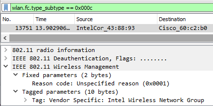
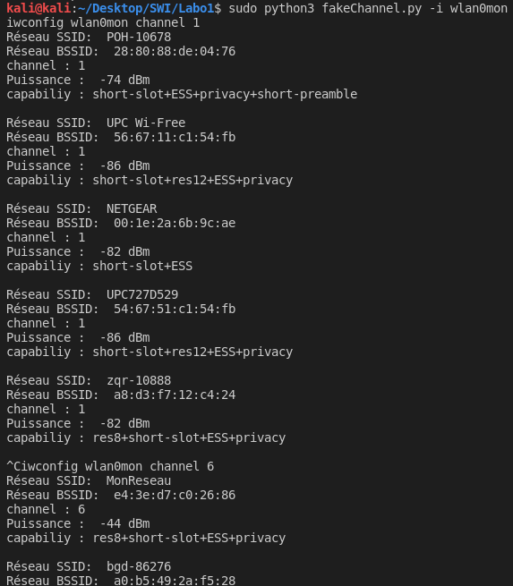
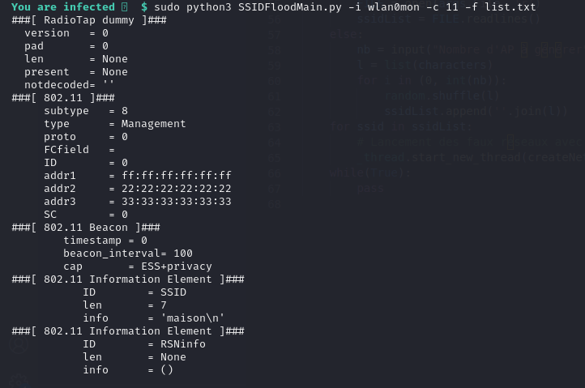
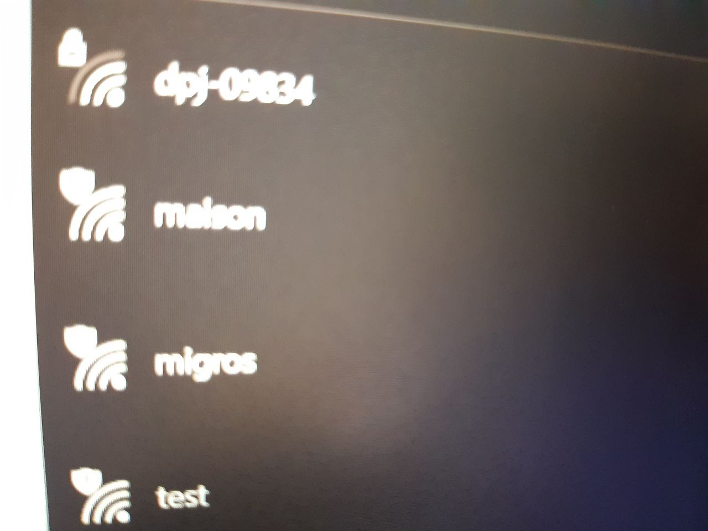
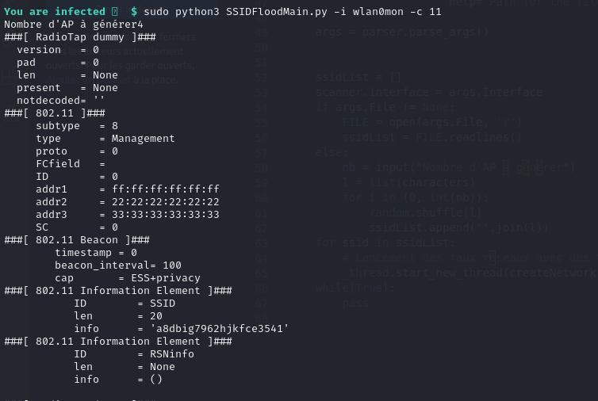
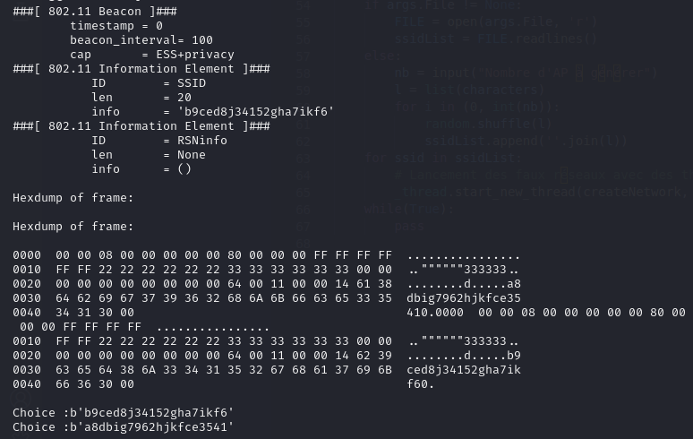
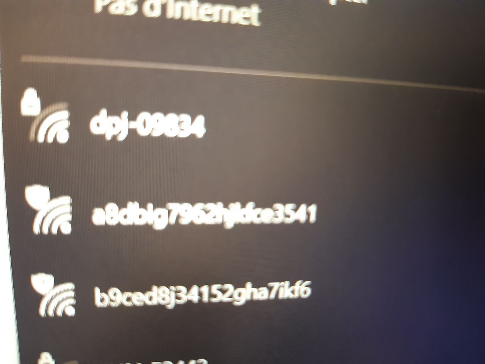
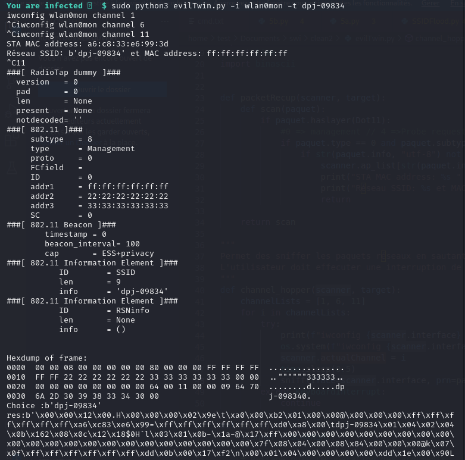
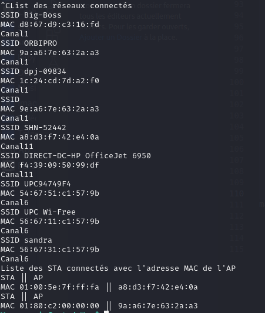

# Sécurité des réseaux sans fil

## Laboratoire 802.11 sécurité MAC

__A faire en équipes de deux personnes__


1. [Deauthentication attack](#1-deauthentication-attack)
2. [Fake channel evil tween attack](#2-fake-channel-evil-tween-attack)
3. [SSID Flood attack](#3-ssid-flood-attack)
4. [Probe Request Evil Twin Attack](#4-probe-request-evil-twin-attack)
5. [Détection de clients et réseaux](#5-d%c3%a9tection-de-clients-et-r%c3%a9seaux)
6. [Hidden SSID reveal](#6-hidden-ssid-reveal)
7. [Livrables](#livrables)
8. [Échéance](#%c3%89ch%c3%a9ance)


### Pour cette partie pratique, vous devez être capable de :

*	Détecter si un certain client WiFi se trouve à proximité
*	Obtenir une liste des SSIDs annoncés par les clients WiFi présents

Vous allez devoir faire des recherches sur internet pour apprendre à utiliser Scapy et la suite aircrack pour vos manipulations. __Il est fortement conseillé d'employer une distribution Kali__ (on ne pourra pas assurer le support avec d'autres distributions). __Si vous utilisez une VM, il vous faudra une interface WiFi usb, disponible sur demande__.

Des routers sans-fils sont aussi disponibles sur demande si vous en avez besoin (peut être utile pour l'exercices challenge 6).

__ATTENTION :__ Pour vos manipulations, il pourrait être important de bien fixer le canal lors de vos captures et/ou vos injections (à vous de déterminer si ceci est nécessaire pour les manipulations suivantes ou pas). Une méthode pour fixer le canal a déjà été proposée dans un laboratoire précédent.

## Quelques pistes utiles avant de commencer :

- Si vous devez capturer et injecter du trafic, il faudra configurer votre interface 802.11 en mode monitor.
- Python a un mode interactif très utile pour le développement. Il suffit de l'invoquer avec la commande ```python```. Ensuite, vous pouvez importer Scapy ou tout autre module nécessaire. En fait, vous pouvez même exécuter tout le script fourni en mode interactif !
- Scapy fonctionne aussi en mode interactif en invoquant la commande ```scapy```.  
- Dans le mode interactif, « nom de variable + <enter> » vous retourne le contenu de la variable.
- Pour visualiser en détail une trame avec Scapy en mode interactif, on utilise la fonction ```show()```. Par exemple, si vous chargez votre trame dans une variable nommée ```beacon```, vous pouvez visualiser tous ces champs et ses valeurs avec la commande ```beacon.show()```. Utilisez cette commande pour connaître les champs disponibles et les formats de chaque champ.
- Vous pouvez normalement désactiver la randomisation d'adresses MAC de vos dispositifs. Cela peut être utile pour tester le bon fonctionnement de certains de vos scripts. [Ce lien](https://www.howtogeek.com/722653/how-to-disable-random-wi-fi-mac-address-on-android/) vous propose une manière de le faire pour iOS et Android. 

## Partie 1 - beacons, authenfication

### 1. Deauthentication attack

Une STA ou un AP peuvent envoyer une trame de déauthentification pour mettre fin à une connexion.

Les trames de déauthentification sont des trames de management, donc de type 0, avec un sous-type 12 (0x0c). Voici le format de la trame de déauthentification :


Le corps de la trame (Frame body) contient, entre autres, un champ de deux octets appelé "Reason Code". Le but de ce champ est d'informer la raison de la déauthentification. Voici toutes les valeurs possibles pour le Reason Code :

| Code | Explication 802.11                                                                                                                                     |
|------|-------------------------------------------------------------------------------------------------------------------------------------------------------|
| 0    | Reserved                                                                                                                                              |
| 1    | Unspecified reason                                                                                                                                    |
| 2    | Previous authentication no longer valid                                                                                                               |
| 3    | station is leaving (or has left) IBSS or ESS                                                                                                          |
| 4    | Disassociated due to inactivity                                                                                                                       |
| 5    | Disassociated because AP is unable to handle all currently associated stations                                                                        |
| 6    | Class 2 frame received from nonauthenticated station                                                                                                  |
| 7    | Class 3 frame received from nonassociated station                                                                                                     |
| 8    | Disassociated because sending station is leaving (or has left) BSS                                                                                    |
| 9    | Station requesting (re)association is not authenticated with responding station                                                                       |
| 10   | Disassociated because the information in the Power Capability element is unacceptable                                                                 |
| 11   | Disassociated because the information in the Supported Channels element is unacceptable                                                               |
| 12   | Reserved                                                                                                                                              |
| 13   | Invalid information element, i.e., an information element defined in this standard for which the content does not meet the specifications in Clause 7 |
| 14   | Message integrity code (MIC) failure                                                                                                                                              |
| 15   | 4-Way Handshake timeout                                                                                                                                              |
| 16   | Group Key Handshake timeout                                                                                                                                              |
| 17   | Information element in 4-Way Handshake different from (Re)Association Request/Probe Response/Beacon frame                                                                                                                                              |
| 18   | Invalid group cipher                                                                                                                                              |
| 19   | Invalid pairwise cipher                                                                                                                                              |
| 20   | Invalid AKMP                                                                                                                                              |
| 21   | Unsupported RSN information element version                                                                                                                                              |
| 22   | Invalid RSN information element capabilities                                                                                                                                              |
| 23   | IEEE 802.1X authentication failed                                                                                                                                              |
| 24   | Cipher suite rejected because of the security policy                                                                                                                                              |
| 25-31 | Reserved                                                                                                                                              |
| 32 | Disassociated for unspecified, QoS-related reason                                                                                                                                              |
| 33 | Disassociated because QAP lacks sufficient bandwidth for this QSTA                                                                                                                                              |
| 34 | Disassociated because excessive number of frames need to be acknowledged, but are not acknowledged due to AP transmissions and/or poor channel conditions                                                                                                                                              |
| 35 | Disassociated because QSTA is transmitting outside the limits of its TXOPs                                                                                                                                              |
| 36 | Requested from peer QSTA as the QSTA is leaving the QBSS (or resetting)                                                                                                                                              |
| 37 | Requested from peer QSTA as it does not want to use the mechanism                                                                                                                                              |
| 38 | Requested from peer QSTA as the QSTA received frames using the mechanism for which a setup is required                                                                                                                                              |
| 39 | Requested from peer QSTA due to timeout                                                                                                                                              |
| 40 | Peer QSTA does not support the requested cipher suite                                                                                                                                              |
| 46-65535 | Reserved                                                                                                                                              |

**a) Utiliser la fonction de déauthentification de la suite aircrack, capturer les échanges et identifier le Reason code et son interpretation.**

La commande que nous avons utilisée est la suivante :

```
 sudo aireplay-ng -0 10 -a dc:a5:f4:60:c2:b0 -c a8:0c:63:4c:43:fa ath0
```

- -0 Pour utiliser la deauthentication
- 10 Nombre de deauth à envoyer
- -a dc:a5:f4:60:c2:b0 est l'adresse MAC de l'AP
- -c a8:0c:63:4c:43:fa est l'adresse MAC du client qu'on veut désauthentifier
- ath0 is the interface name

Source : [Deauthentication Aircrack-ng](https://www.aircrack-ng.org/doku.php?id=deauthentication)

__Question__ : Quel code est utilisé par aircrack pour déauthentifier un client 802.11. Quelle est son interpretation ?


On peut voir sur l'image ci-dessus que le code utilisé est 7. Ce code est normalement utilisé lorsqu'un client a essayé d'envoyer des données en couche 3 (IP) à l'AP alors qu'il n'étais pas authentifié. L'AP lui envoie donc cette trame.

__Question__ : A l'aide d'un filtre d'affichage, essayer de trouver d'autres trames de déauthentification dans votre capture. Avez-vous en trouvé d'autres ? Si oui, quel code contient-elle et quelle est son interprétation ?



Nous avons capturé cette trame qui cette fois a été envoyée à l'AP par une station. Cette fois le code est 1, la raison de la déauthentification n'a donc pas été spécifiée.


Plus tard, lors des tests de nos scripts, nous avons également aperçus le code 6, qui est envoyé pour les mêmes raisons que le code 7 mais cette fois le client a essayé d'envoyer des données en couche 2 (MAC).


Enfin nous avons également vu ce code, apparu souvent après ou pendant l'essai de nos scripts. Il s'agit du code 15 qui signifie que le processus du 4-way handshake n'a pas pu aboutir car un des paquets a mis trop de temps a arriver, il a donc timeout. L'AP envoie donc ce message pour que le client recommence le processus d'authentification puis le 4-way handshake.

**b) Développer un script en Python/Scapy capable de générer et envoyer des trames de déauthentification. Le script donne le choix entre des Reason codes différents (liste ci-après) et doit pouvoir déduire si le message doit être envoyé à la STA ou à l'AP :**

* 1 - Unspecified
* 4 - Disassociated due to inactivity
* 5 - Disassociated because AP is unable to handle all currently associated stations
* 8 - Deauthenticated because sending STA is leaving BSS

Note : L'entièreté des scripts que nous avons développés sont conçus pour fonctionner sur un environnement Linux étant donné que nous utilisons des appels à des fonctions du système d'exploitation (iwconfig par exemple).

Voici une image du script de désauthentification en fonctionnement. Une capture Wireshark a également été faite. On peut y voir les trames avec les 4 différents codes pouvant être utilisés avec le script ( [DeauthScript.pcapng](WiresharkCaptures\DeauthScript.pcapng) ).


Lien du script :  [deauthScript.py](Scripts\deauthScript.py) 

__Question__ : quels codes/raisons justifient l'envoie de la trame à la STA cible et pourquoi ?

Le code 4 car la dissociation due à l'inactivité signifie que le client a atteint la limite de temps pendant laquelle l'authentification restait valide sans nouveau message de la part du client. Cela permet d'éviter d'avoir une quantité infinie de sessions actives sur les AP si le client n'envoie pas de message de désauthentification lorsqu'il se déconnecte.

Le code 5 également car il signifie que l'AP est surchargé et qu'il déconnecte des stations pour pouvoir s'en sortir.

Enfin on pourrait également dire que le code 1 peut être envoyée par l'AP, ce code disant que la raison est non spécifiée, la trame pourrais tout a fait être émise par l'AP.

__Question__ : quels codes/raisons justifient l'envoie de la trame à l'AP et pourquoi ?

Le code 8 car il signifie que le système d'exploitation a déplacé la connexion sur un autre access point et qu'il n'a donc plus besoin de l'association à l'ancien AP.

Le code 1 peut également être utilisé par le client, comme vu plus haut. Plein de choses peuvent se passer sur le client, y compris des implémentations pas très correctes des normes ou des erreurs qui ne rentrent dans aucune catégorie ou encore pour effectuer des tests.

__Question__ : Comment essayer de déauthentifier toutes les STA ?

On peut utiliser l'adresse MAC FF:FF:FF:FF:FF:FF qui envoie la trame en broadcast, ainsi toutes les stations seront déconnectées. Toutefois certaines cartes réseau/systèmes d'exploitations/configurations ignorent les désauthentifications envoyées en broadcast.

__Question__ : Quelle est la différence entre le code 3 et le code 8 de la liste ?

Le code 3 est un code normalement envoyé par l'AP qui informe le client qu'il va être hors-ligne etqu'il déconnecte donc le client.

Le code 8 est normalement envoyé par le client pour informer l'AP qu'il quitte l'association pour différentes raison, généralement pour changer d'AP.

__Question__ : Expliquer l'effet de cette attaque sur la cible

La cible perd momentanément la connexion wifi, voir plus longtemps tant que l'attaque continue. A chaque fois qu'elle va essayer de se reconnecter un trame de désauthentification va arriver, forçant l'AP ou la cible a se déconnecter de nouveau et à recommencer la phase d'authentification. Le résultat est donc une impossibilité de se (re)connecter au wifi pour la cible.

### 2. Fake channel evil tween attack
a)	Développer un script en Python/Scapy avec les fonctionnalités suivantes :

* Dresser une liste des SSID disponibles à proximité
* Présenter à l'utilisateur la liste, avec les numéros de canaux et les puissances
* Permettre à l'utilisateur de choisir le réseau à attaquer
* Générer un beacon concurrent annonçant un réseau sur un canal différent se trouvant à 6 canaux de séparation du réseau original

Script :  [fakeChannelMain.py](Scripts\fakeChannelMain.py) 

Lien script en tant que "librairie" :  [fakeChannel.py](Scripts\fakeChannel.py) 

Ne pas appeler en tant que tel (la lubrairie)

Script en fonctionnement :




__Question__ : Expliquer l'effet de cette attaque sur la cible

Cette attaque a pour effet de créer un faux AP qui propose un faux réseau extrêmement similaire à un réseau légitime. Le but est que la cible se connecte à notre faux réseau sans qu'elle s'en rende compte et que l'on puisse donc récupérer l'entièreté du trafic voir même modifier les paquets qui transitent par notre Evil Twin.

Dans les fait c'est un peu plus compliqué dû au fait que la cible garde un profil des réseaux auxquels elle c'est déjà connectée et qu'en plus elle préfèrera toujours le réseau avec une sécurité plus élevée quand ils ont le même SSID. Cette attaque est donc plutôt efficace avec les wifi publics comme les aéroports, Mc Donalds, etc.


### 3. SSID flood attack

*Développer un script en Python/Scapy capable d'inonder la salle avec des SSID dont le nom correspond à une liste contenue dans un fichier text fournit par un utilisateur. Si l'utilisateur ne possède pas une liste, il peut spécifier le nombre d'AP à générer. Dans ce cas, les SSID seront générés de manière aléatoire.*

**Réponse**

Script A APPELER  : [SSIDFloodMain](Scripts/SSIDFloodMain.py) 

Lien script en tant que "librairie" : [SSIDFlood](Scripts/SSIDFlood.py) 

Ne pas appeler en tant que tel

- Avec liste



Apparition des réseaux sur l'ordinateur



- Sans liste






Apparition des réseaux sur l'ordinateur



## Partie 2 - probes

## Introduction

L’une des informations de plus intéressantes et utiles que l’on peut obtenir à partir d’un client sans fils de manière entièrement passive (et en clair) se trouve dans la trame ``Probe Request`` :


Dans ce type de trame, utilisée par les clients pour la recherche active de réseaux, on peut retrouver :

* L’adresse physique (MAC) du client (sauf pour dispositifs iOS 8 ou plus récents et des versions plus récentes d'Android). 
	* Utilisant l’adresse physique, on peut faire une hypothèse sur le constructeur du dispositif sans fils utilisé par la cible.
	* Elle peut aussi être utilisée pour identifier la présence de ce même dispositif à des différents endroits géographiques où l’on fait des captures, même si le client ne se connecte pas à un réseau sans fils.
* Des noms de réseaux (SSID) recherchés par le client.
	* Un Probe Request peut être utilisé pour « tracer » les pas d’un client. Si une trame Probe Request annonce le nom du réseau d’un hôtel en particulier, par exemple, ceci est une bonne indication que le client s’est déjà connecté au dit réseau. 
	* Un Probe Request peut être utilisé pour proposer un réseau « evil twin » à la cible.

Il peut être utile, pour des raisons entièrement légitimes et justifiables, de détecter si certains utilisateurs se trouvent dans les parages. Pensez, par exemple, au cas d'un incendie dans un bâtiment. On pourrait dresser une liste des dispositifs et la contraster avec les personnes qui ont déjà quitté le lieu.

A des fins plus discutables du point de vue éthique, la détection de client s'utilise également pour la recherche de marketing. Aux Etats Unis, par exemple, on "sniff" dans les couloirs de centres commerciaux pour détecter quelles vitrines attirent plus de visiteurs, et quelle marque de téléphone ils utilisent. Ce service, interconnecté en réseau, peut aussi déterminer si un client visite plusieurs centres commerciaux un même jour ou sur un certain intervalle de temps.

### 4. Probe Request Evil Twin Attack

Nous allons nous intéresser dans cet exercice à la création d'un evil twin pour viser une cible que l'on découvre dynamiquement utilisant des probes.

Développer un script en Python/Scapy capable de detecter une STA cherchant un SSID particulier - proposer un evil twin si le SSID est trouvé (i.e. McDonalds, Starbucks, etc.).

Pour la détection du SSID, vous devez utiliser Scapy. Pour proposer un evil twin, vous pouvez très probablement réutiliser du code des exercices précédents ou vous servir d'un outil existant.

**Réponse**

Lien script : [evilTwin](Scripts/evilTwin.py) 



__Question__ : comment ça se fait que ces trames puissent être lues par tout le monde ? Ne serait-il pas plus judicieux de les chiffrer ?

Il serait en effet plus judicieux de les chiffrer mais en faisant ça la station ne pourrait se connecter qu'à un seul AP et dans le cas d'un réseau de campus par exemple on ne pourrais pas se balader étant donné que la station ne pourra pas changer d'AP connecté car la trame de probe request étant chiffrée le nouvel AP ne saura pas que la station cherche son réseau.

__Question__ : pourquoi les dispositifs iOS et Android récents ne peuvent-ils plus être tracés avec cette méthode ?

Car ils randomisent les adresses MAC qu'ils envoient dans leurs probe request. On ne peut donc plus suivre la cible puisqu'on ne peut plus l'identifier au milieu de toutes les autres adresses mac/probes request.


### 5. Détection de clients et réseaux

*a) Développer un script en Python/Scapy capable de lister toutes les STA qui cherchent activement un SSID donné*

**Réponse**

Lien script : [5a](Scripts/5a.py) 


b) Développer un script en Python/Scapy capable de générer une liste d'AP visibles dans la salle et de STA détectés et déterminer quelle STA est associée à quel AP. Par exemple :

STAs &nbsp; &nbsp; &nbsp; &nbsp; &nbsp; &nbsp; &nbsp; &nbsp; &nbsp; &nbsp; &nbsp; &nbsp; &nbsp; &nbsp; &nbsp; &nbsp; &nbsp; &nbsp; &nbsp; APs

B8:17:C2:EB:8F:8F &nbsp; &nbsp; &nbsp; &nbsp; &nbsp; &nbsp; 08:EC:F5:28:1A:EF

9C:F3:87:34:3C:CB &nbsp; &nbsp; &nbsp; &nbsp; &nbsp; &nbsp; 00:6B:F1:50:48:3A

00:0E:35:C8:B8:66 &nbsp; &nbsp; &nbsp; &nbsp; &nbsp; &nbsp; 08:EC:F5:28:1A:EF

**Réponse**

Lien script : [5b](Scripts/5a.py) 




### 6. Hidden SSID reveal (exercices challenge optionnel - donne droit à un bonus)

Développer un script en Python/Scapy capable de reveler le SSID correspondant à un réseau configuré comme étant "invisible".

__Question__ : expliquer en quelques mots la solution que vous avez trouvée pour ce problème ?


## Livrables

Un fork du repo original . Puis, un Pull Request contenant :

- Script de Deauthentication de clients 802.11 __abondamment commenté/documenté__

- Script fake chanel __abondamment commenté/documenté__

- Script SSID flood __abondamment commenté/documenté__

- Script evil twin __abondamment commenté/documenté__

- Scripts détection STA et AP __abondamment commenté/documenté__

- Script SSID reveal __abondamment commenté/documenté__


- Captures d'écran du fonctionnement de chaque script

-	Réponses aux éventuelles questions posées dans la donnée. Vous répondez aux questions dans votre ```README.md``` ou dans un pdf séparé

-	Envoyer le hash du commit et votre username GitHub par email au professeur et à l'assistant


## Échéance

Le 31 mars 2022 à 23h59
